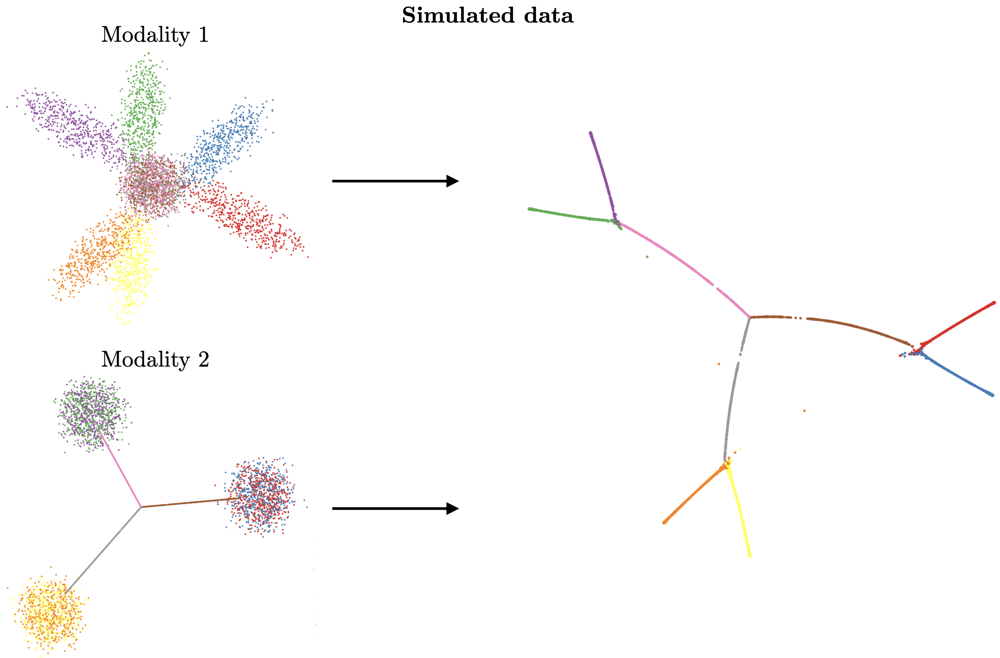
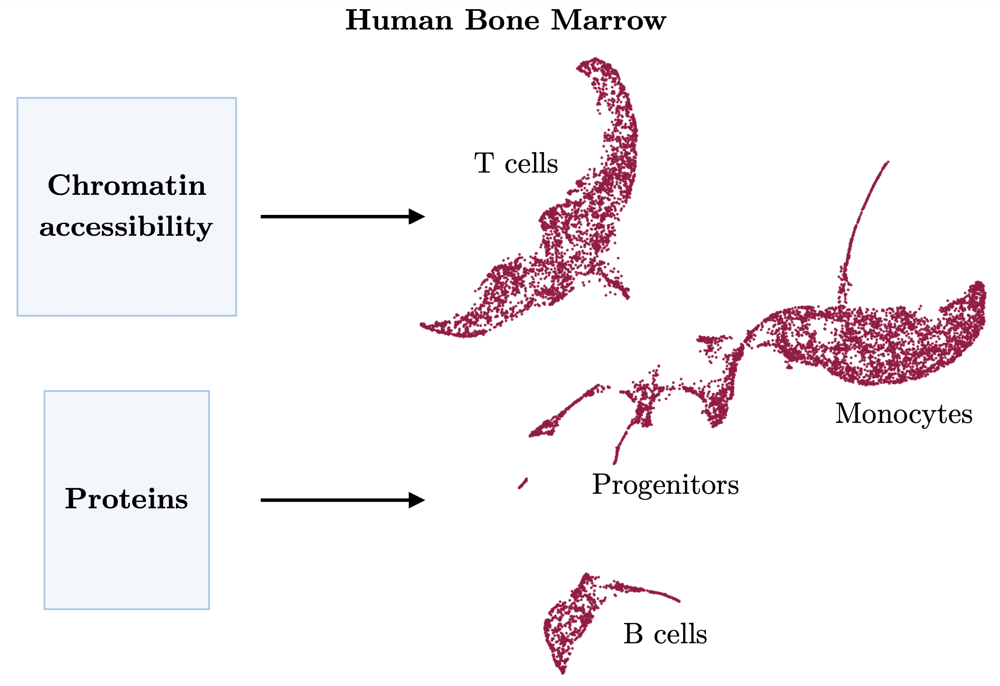
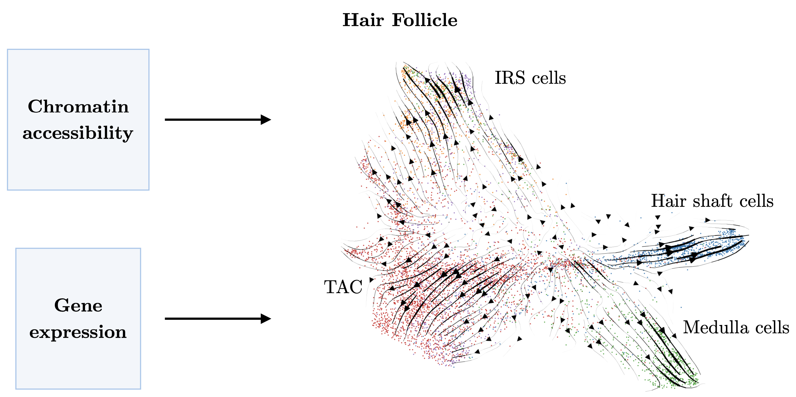

Ocelli
==================================

**Ocelli** is a computational tool for visualizing multimodal single-cell developmental data. It includes a novel Multimodal Diffusion Maps algorithm for embedding multimodal datasets into low-dimensional latent spaces.

*Ocelli (singular Ocellus, Latin: little eye) – simple eyes found in many insects in triplets. Their function is to navigate insects during the day or to detect movement.*

The source code is available on GitHub_.

.. toctree::
   :caption: Documentation
   :hidden:

   installation
   usage_principles
   api
   
.. toctree::
   :maxdepth: 4
   :caption: Tutorials
   
   notebooks/getting-started
   notebooks/hair-follicle
   notebooks/human-bone-marrow
   notebooks/unimodal
   
.. _GitHub: https://github.com/TabakaLab/ocelli
